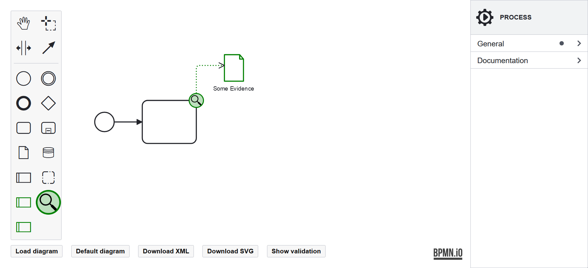

# Model Creation

After creating the baseline, asset-level BPMN model, it can be enriched with BPMN4FRSS constructs. The constructs, their semantics, and how to model them using the FREAS editor are described below.

## Evidence Source

Denotes where potential evidence originates within the process model. It can be attached to a Task, Event, or Data Store, which maps into an IS Asset (i.e., a part of the system). Each Potential Evidence must have exactly one Evidence Source.

??? Demo
    

## Potential Evidence

Denotes a piece of data that bears importance to the investigation of an incident. Thus, it is a special case of Data Object. Each Potential Evidence must have its origin (Evidence Source) and should have an Evidence Store defined; otherwise, it cannot be retrieved during the investigation.

The Potential Evidence can be modelled by marking a Data Object in its context pad. Generally, the potential evidence can be divided into two categories: foreground and background evidence. The Foreground evidence utilises Data Objects that are a part of the underlining process. Such can be, in addition, marked as Potential Evidence and supplied with further details relevant to forensic readiness. The background evidence is defined just for the purpose of forensic readiness and does not have significant value to the underlining process.

Two instances of Potential Evidence can be associated with each other by an Evidence Association, describing a relationship specified by an expression (e.g., equality of some fields) and optionally timing by direction (i.e., A precedes B). The association is modelled by drawing a connection between two instances of Potential Evidence.

??? Demo
    

## Evidence Store

Denotes a part of a system where Potential Evidence is stored for retrieval during an investigation. Thus, it is modelled as a special case of Data Store. The stored Potential Evidence is recorded using the properties panel.

??? Demo
    

## Evidence Context

Denotes contextual information pertaining to the Potential Evidence, Evidence Source, and Evidence Store. It is an extension of Pool, further specifying a level of cooperation of the process participant in the case of investigation. For example, a customer's device is likely to not cooperate when investigating a misuse. On the other hand, a system under the organisation's control shall cooperate in yielding evidence.

The cooperativeness can be set to Cooperative (the participant shall yield the evidence), Semi-Cooperative (under some condition, the participant shall yield the evidence), and Non-Cooperative (the participant shall not yield evidence). The default is Non-Cooperative to make all assumptions explicit.

??? Demo
    

## Forensic Readiness Task

Denotes a specialised Task, a highly abstract atomic activity relevant to forensic readiness (e.g., creating a proof of integrity). The Forensic Readiness Task can be further specified as Authenticity Computation, Integrity Computation, and Data Transformation. The first two create proofs of authenticity or integrity, which can overlap. Outputs of those Tasks are new pieces of Potential Evidence providing assurances of another Potential Evidence (represented by the Evidence Association). Another specialised Forensic Readiness Task is Data Transformation, allowing for its documentation and validation to assert the impact on the meaning of Potential Evidence.

The Forensic Readiness Task can be specified in the properties panel when there is one Potential Evidence on the input and one Potential Evidence on the output.

??? Demo
    

## Forensic Readiness Service

Denotes a participating external service which plays a role in forensic readiness (e.g., a notary service). These also output new pieces of Potential Evidence to provide assurances. The supported Forensic Readiness Services are concrete types of services: PKI Timesaving Service and Blockchain Timesaving Service. They are modelled as a specialised, collapsed Pool.

??? Demo
    