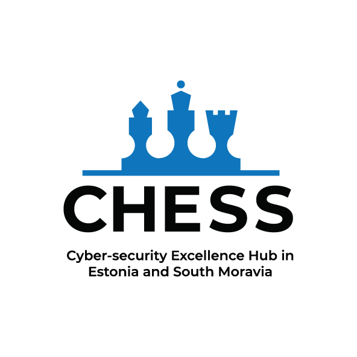

# Acknowledgement

The work was supported by the Grant Agency of Masaryk University (GAMU) project **“Forensic Support for Building Trust in Smart Software Ecosystems”, registration number MUNI/G/1142/2022**. It was also co-founded by the **European Union under Grant Agreement No. 101087529**. Views and opinions expressed are however those of the author(s) only and do not necessarily reflect those of the European Union or European Research Executive Agency. Neither the European Union nor the granting authority can be held responsible for them.

  <figure style="text-align: center; width: 32%; margin: 0;">
    
  </figure>

  <figure style="text-align: center; width: 32%; margin: 0;">
    
  </figure>

  <figure style="text-align: center; width: 32%; margin: 0;">
    
  </figure>

